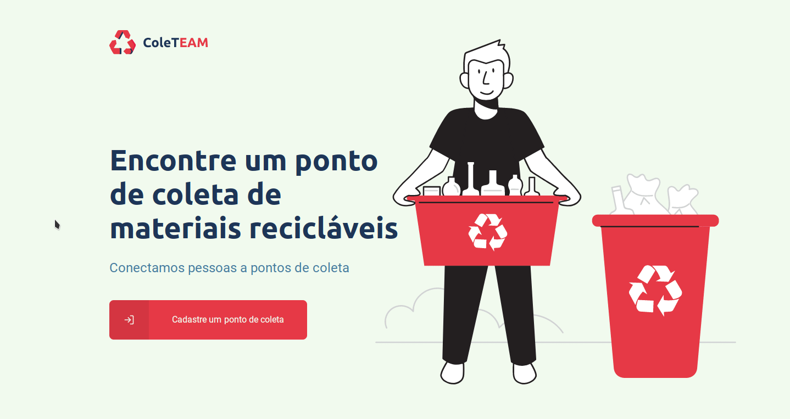
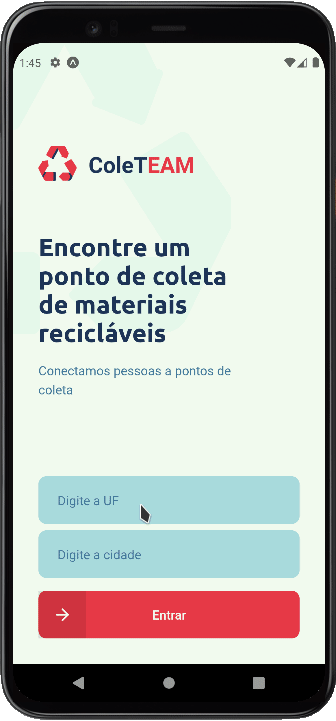

# COLETEAM

Este projeto consiste no desenvolvimento de uma
prova de conceito de um sistema de um protótipo
completo.

A principal ideia é desenvolver um aplicativo para
celular no qual as pessoas possam encontrar locais
próximos de suas casas para realizar o descarte de
materiais recicláveis, e um cliente web, no qual usinas de
reciclagem e intermediadores como lojas,
estabelecimentos, ONGs e empresas possam cadastrar
locais que servirão de pontos de coleta para esses
usuários.

O trabalho compõe requisito parcial da disciplina ECOT01 -
Engenharia de Software I do curso Engenharia de Computação
da Universidade Federal de Itajubá.

## 🤳 Demo

**💻 Cliente WEB**


**📱 APP Mobile**

<p  align="center">

</p>

## 🧰 Tecnologias

Para testar o projeto é necessário ter instalado em
seu ambiente algumas ferramentas:

- [x] Node
- [x] Yarn
- [x] Expo
- [x] Emulador ou ExpoGo no dispositivo físico

## Testar o aplicativo

Clonar o projeto

```bash
  git clone https://github.com/areasflavio/coleteam
```

Ir para a pasta do projeto

```bash
  cd coleteam
```

Para iniciar o servidor backend

```bash
  cd backend # Entrar na pasta

  yarn # Instalar as dependências

  yarn dev # Iniciar o servidor
```

Para iniciar o cliente web

```bash
  cd web # Entrar na pasta

  yarn # Instalar as dependências

  yarn dev # Iniciar o cliente
```

Para iniciar o aplicativo mobile

```bash
  cd mobile # Entrar na pasta

  yarn # Instalar as dependências

  yarn start # Iniciar o Expo
```

## Autores

- [Luiz Emanoel](https://www.github.com/emanoel-dev)
- [João Tonet](https://www.github.com/JoaoTonet)
- [Flávio Arêas](https://www.github.com/areasflavio)
- [Felipe Dutra](https://www.github.com/felipedutr)
- [João Victor Monteiro](https://github.com/JVSadan)
